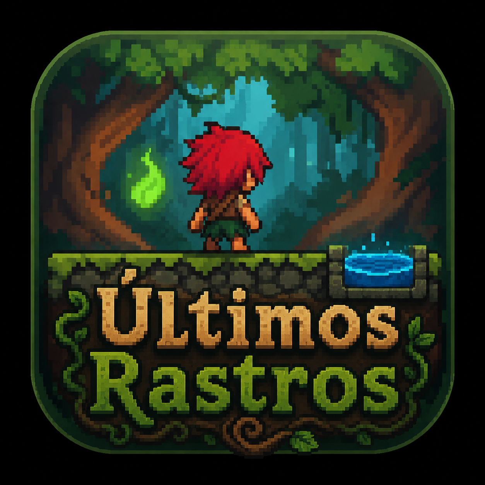

<div align="center">
  

  <h1>Últimos Rastros</h1>

  <p>Plataforma 2D de aventura inspirada no folclore brasileiro. Controle o Curupira, espírito esquecido da floresta, enquanto recupera memórias perdidas e restaura seus poderes.</p>

  <p>
    
    
    
    
  </p>
</div>

---

## Sobre o Jogo

**Últimos Rastros** é um jogo 2D de plataforma com temática de folclore brasileiro. O jogador controla o **Curupira**, um espírito da floresta que está sendo esquecido pelo mundo moderno. Ao longo de 3 fases, ele coleta memórias espalhadas pelo mapa, enfrenta inimigos variados e bosses únicos para restaurar sua existência.

### Mecânicas principais

- **Movimentação** — corrida com duplo toque, salto com coyote time e jump buffer
- **Combate** — ataque corpo a corpo e projéteis (Fire Arrow)
- **Coleta** — memórias espalhadas pelo mapa desbloqueiam o final
- **Inimigos** — patrulha, perseguição e bosses com múltiplas fases (Plent, Skeleton, Orc)
- **Saves** — sistema de salvamento automático entre fases
- **Histórico** — ranking de runs por tempo e mortes

---

## Tecnologias

| Tecnologia | Uso |
|---|---|
| **Python 3.10+** | Linguagem principal |
| **Pygame 2.6** | Engine de jogo (renderização, input, áudio) |
| **PyInstaller** | Geração de executável |

---

## Pré-requisitos

- Python 3.10 ou superior
- pip

---

## Instalação e execução

### 1. Clone o repositório

```bash
git clone https://github.com/lucasrbsouza/ultimos-rastros.git
cd ultimos-rastros
```

### 2. Instale as dependências

```bash
pip install pygame
```

### 3. Execute o jogo

```bash
python main.py
```

---

## Controles

| Tecla | Ação |
|---|---|
| `A` / `D` | Mover esquerda / direita |
| `Espaço` | Pular (pressione duas vezes para pular duplo) |
| `A` `A` ou `D` `D` | Duplo toque para correr |
| `J` | Atacar |
| `K` | Disparar Fire Arrow |
| `ESC` | Pausar / Menu |

---

## Gerando o Executável

### Linux

**Instale o PyInstaller:**

```bash
pip install pyinstaller
```

**Gere o executável:**

```bash
pyinstaller --onefile --name "UltimosRastros" --add-data "assets:assets" main.py
```

O binário será gerado em `dist/UltimosRastros`. Para executar:

```bash
chmod +x dist/UltimosRastros
./dist/UltimosRastros
```

---

### Windows

**Instale Python e as dependências:**

```cmd
pip install pygame pyinstaller
```

**Gere o executável com ícone:**

```cmd
pyinstaller --onefile --name "UltimosRastros" --add-data "assets;assets" --noconsole --icon "assets\logo_jogo.ico" main.py
```

> **Atenção:** No Windows o separador do `--add-data` é `;` (ponto e vírgula).

O executável será gerado em `dist\UltimosRastros.exe`.

---

## Estrutura do Projeto

```
ultimos-rastros/
├── main.py               # Entry point e máquina de estados
├── level.py              # Lógica de fase, colisões e câmera
├── levels.py             # Mapas das 3 fases e constantes
├── player.py             # Controle e mecânicas do jogador
├── sprites.py            # Inimigos, projéteis, tiles e coletáveis
├── background.py         # Parallax background
├── ui.py                 # HUD (vida, memórias)
├── menu.py               # Menus (principal, game over, vitória, créditos)
├── boss_arena.py         # Lógica das arenas de boss
├── cutscene.py           # Sistema de cutscenes
├── shop.py               # Sistema de loja
├── save_system.py        # Save e histórico de runs
├── settings.py           # Constantes globais
└── assets/
    ├── player_spritesheet/   # Idle, Walk, Run, Jump, Attack, Hurt
    ├── enemies/              # Sprites dos inimigos (fly, Plent, Skeleton, Slimes, Orc)
    ├── player_power/         # Fire Arrow (8 frames)
    ├── sounds/               # BGM e efeitos sonoros
    ├── background_parallax/  # 5 camadas de parallax
    ├── backgrounds_statics/  # Fundos de menu, game over e vitória
    ├── objetos/              # Árvores e arbustos decorativos
    ├── Tileset.png           # Spritesheet de tiles (grid 16px)
    ├── Rune.png              # Sprite da memória coletável
    └── logo_jogo.png         # Logo do jogo
```

---

## Contribuindo

Contribuições são bem-vindas! Leia o [CONTRIBUTING.md](CONTRIBUTING.md) para entender o fluxo de trabalho.

## Código de Conduta

Este projeto adota o [Código de Conduta](CODE_OF_CONDUCT.md). Ao participar, você concorda em respeitá-lo.

## Licença

Distribuído sob a licença MIT. Veja [LICENSE](LICENSE) para mais detalhes.

---

<div align="center">
  <p>Desenvolvido como trabalho da disciplina de <strong>Desenvolvimento de Jogos</strong></p>
</div>
